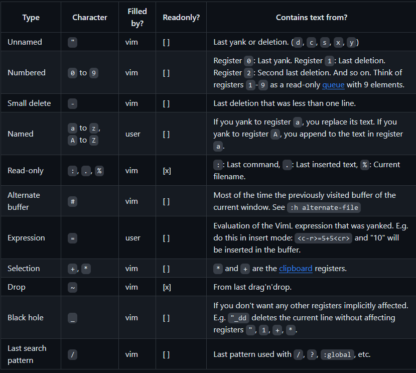

# Vim

Sources : <https://www.youtube.com/watch?v=-txKSRn0qeA>
          <https://github.com/mhinz/vim-galore?tab=readme-ov-file##first-steps>
          <https://books.google.be/books/about/Learning_the_Vi_and_Vim_Editors.html?id=Eb8J3BONVxAC&source=kp_cover&redir_esc=y>

[Cheatsheet](.vim_cheatsheet.md)

## Introduction

### Qu'est ce que Vim ?

C'est un éditeur de text qui prend ses origines de *Vi* un éditeur de text
implementé à *Unix*. Site : <http://www.vim.org>.

Reference : <http://www.viemu.com/a-why-vi-vim.html> (à propos de misconception
fréquente).

### Vim Philosophie

Vim Adhère au *modal editing*, càd qu'il propose différents modes dans lesquels
les touches ont des sens différents. L'avantage principale de cette méthode est
que cela n'implique pas de devoir tenir pleins de touches en même temps.

Les **opérateurs** servent à demarer une certain action (ex: changer, enlever
ou selectionner du text). On peut ainsi, selectionner la portion de text sur
laquelle on veut faire l'action en utiliser un **motion**.

S'habituer à Vim permet de devlopper la memoir musculaire et ainsi permettre de
reduire l'attention porter à l'édition de text pour pouvoir se concentrer
plainement sur la tâche occupée.

### Initiation

On instal vim très simplement : `sudo pacman -S vim`, on peut ensuite rentrer
dedans grâce à la commande `vim`. Il y a un tutoriel proposé accesible grâce à
la commande `vimtutor`.

Vim supporte 2 modes d'opérations : compatible et non-compatible. Compatible
signifie qu'on utilise *Vi* pour toutes les options par défaut en opposition
aux defauts de Vim.

Etapes suivantes :

- Crée son vimrc
- Faire ses antisèches
- Lire la section *Bases* pour apprendre ce qu'il est possible de faire grâce
  à vim.
- Apprendre à la demande. Vim ne finit jamais de s'apprendre.
- Regarder les ressources additionelles :
  <https://github.com/mhinz/vim-galore?tab=readme-ov-file#additional-resources>

### Minimal vimrc

`mkdir -p ~/.vim ~/.vim/autoload ~/.vim/backup ~/.vim/colors ~/.vim/plugged`  
`code .vimrc`  
Copié coller ce ficher : <https://github.com/mhinz/vim-galore/blob/master/static/minimal-vimrc.vim>

### Version

`:version` permet d'avoir des information sur la version utilisé ; la première
ligne indique quand le binary à été compilé pour la dernière fois. La ligne
suivante indique le niveau du patch.  
Une ligne ressemble à : *Huge/Tiny version with/without GUI*, *GUI* indique si
la version inclu un support GUI ou non. *Tiny* et *Huge* indique les
caractèristiques des différents sous ensembles.  
*+/- clipboard*, indique, si il y a un +, que le clipboard a été compilé.

## Bases

### Buffers, Windows et Tabs

**Buffers** : est un espace temporel dans le disque dur pour stocker le fichier
ouvert. Chaque fichier est ouvert dans son propre *buffer*. Les buffers peuvent
avoir différents atribut en fonction de la modifiabilité du text.

**Windows** : sont des vues sur les buffers. Peuvent être divisée en plusieurs
arrangements.

**Tab** : est une collection de *windows*.

Par default, vim ouvre une *tab* qui contient une *window* qui montre un *buffer*.

### Active, Loaded, Listed and Named Buffers

La commande `vim nomdufichier`, permet de **loader** le fichier dans un buffer.

Comme le buffer est montrer dans une *window* il est aussi appeler un
**Active** *buffer*. Si on *load* un nouveau fichier, le premier deviendra un
**Hidden** *buffer*.  
On peut ouvrir un nouveau fichier grâce à la commande ':e nouveaufichier`.

Les deux *buffers* sont **listed**, on peut les afficher avec la commande
`:ls`. Certain *buffers* ne sont pas lister par defaut, on peut les afficher
avec `ls!`.

On peut crée un **Unnamed** *buffer* avec `:enew`, et ensuite le nommer avec `:w
/path/to/namefile` et alors il sera un **named** *buffer*.

### Argument list

NON DISPONIBLE DANS VS CODE. VOIR LIVRE POUR PLUS D'INFO

### Mappings

ONN DISPONIBLE

### Registers

Les *registers* sont des endroits où l'on peut copier du texte. Savegarder le
text s'appelle *yanking*, et le resortir *pasting*.  
Registers fournis pas Vim : 

`y`pour copier, `p` pour coller. `yy`copie la ligne courante. `p`imprime en
dessous, `P` imprime au dessus.

Pour enregistrer un *register* on l'appel avec `"... + commande voulue`, et
on le rapelle de la même manière

**Ex** :"aY copie la ligne et l'enregistre dans le *register* a. Ensuite "ap le
colle en dessous.

On peut retrouver nos *registers* grâce à `:reg`.

### Ranges

Le rang est l'ensembles des lignes sur lesquelles la commandes qui la précèdes
va s'appliquer. Le rang par défaut est la ligne courante (sauf exp). Pour
définir plusieurs lignes, on sépare les adresses par *,* ou *;*

Indicateurs : "." agit sur la première ligne, "1" agit sur la première ligne,
"$" sur la dernière ligne. On peut les combiner : "1,$" agit sur tout, mais on
utilise plus souvent "%" pour toutes les lignes. "+3" indique trois lignes
après la ligne courante, "-3" l'inverse.  
3,'xdelete indique de la ligne 3 à la ligne *mark* par x. (voir *mark*).
/^word/, $ de la prochaine ligne qui commence par word jusqu'à la fin.
/^word/+1.

Si on utilise le ; à la place de la , ça indique un "et" plutot qu'un "jusqu'à".

/ peut être précédé par d'autres adresse : /mots//word//name/d, suprime la
première ligne avec "name" après la première ligne avec "word" après la
première ligne avec "mots".

### Marks

On utilise des *marks* pour se souvenir d'une position (x, y).
' devant un mark form un mouvement (première caractère n-blanc de la ligne)
` va à la colonne exact.

setup : `mX` => mark retenu = x

voirs les mark `:mark`
Peut aussi fonctionner sur un *range*

### Completion